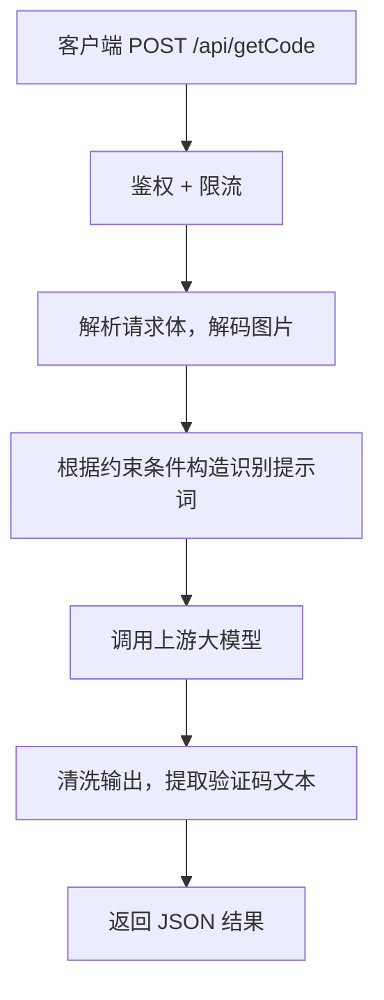

# captchaGPT

基于 AI 大模型的图片验证码识别 API 服务，使用 Go 编写。

把验证码图片的 Base64 发送到 `POST /api/getCode`，即可获得识别后的文本结果。

## 项目概述

### 这是什么

captchaGPT 是一个轻量的验证码识别后端服务。它接收验证码图片，调用多模态大模型（默认为 NVIDIA 托管的 `nvidia/nemotron-nano-12b-v2-vl`，注册即可申请免费 API Key）进行识别，并返回纯文本结果。

核心设计原则：

- **专注验证码**：不开放通用问答，提示词限定为"只识别验证码文本"
- **服务端管控**：模型名称、上游配置均由服务端决定，客户端无法覆盖
- **开箱即用**：Release 包解压后配置两个 Key 即可启动

### 适用范围

适合识别的类型：

- 数字/字母/混合验证码
- 带少量噪点、扭曲、干扰线的静态图片验证码
- 图片算术验证码，例如 `20-18=?`
- 中文算术验证码，例如“九乘六等于?”

不适合的类型：滑块验证码、点选验证码、拼图验证码、轨迹/行为验证类人机校验。

### 工作原理



1. 客户端上传验证码图片 Base64 + 可选的约束条件（长度、字符集等）
2. 服务端鉴权、限流、校验图片格式和大小
3. 根据约束条件生成受限提示词，连同图片发给上游模型
4. 模型返回后，服务端只提取验证码文本，返回统一 JSON
5. 成功响应里会包含 `duration_ms`，表示本次识别耗时（毫秒）
6. 如果请求指定 `captcha.task=math`，服务会返回最终计算结果数字
7. 服务启动时默认会做一次上游模型自检，并打印回复内容与耗时

## 使用

### 快速开始

1. 从 [Releases](https://github.com/your-repo/captchaGPT/releases) 下载对应系统的压缩包并解压
2. 将 `.env.example` 复制为 `.env`，填入 `NVIDIA_API_KEY` 和 `USER_API_KEY`
3. 启动服务
4. 发送请求测试

**Windows：**

```powershell
.\start.bat
```

**Linux：**

```bash
chmod +x ./captchaGPT
./captchaGPT
```

### 详细使用文档

完整的 API 接口定义、请求参数说明、返回格式、错误码以及多语言调用示例，请参阅 **[QUICKSTART.md](QUICKSTART.md)**。

## 开发

### 环境要求

- Go 1.21+
- 有效的 NVIDIA API Key

### 项目结构

```text
CaptchaGPT/
├── cmd/api/          # 程序入口
├── internal/         # 内部逻辑（路由、中间件、上游调用等）
├── scripts/          # 辅助脚本（测试、打包等）
├── docs/             # 开发文档
├── sample.png        # 示例验证码图片
├── .env.example      # 环境变量模板
├── start.bat         # Windows 快捷启动
├── build-release.ps1 # Release 打包脚本
└── README.md
```

### 本地运行

在项目根目录创建 `.env` 文件（参考 `.env.example`），然后：

```powershell
go run ./cmd/api
```

程序会优先读取当前工作目录下的 `.env`，如果不存在则回退到可执行文件所在目录。

默认情况下，服务启动后会自动请求一次上游模型，发送简单问候语并打印：

- 上游是否可用
- 模型回复内容
- 响应耗时（毫秒）

如果你不想在启动时做这一步，可以在 `.env` 中设置：

```dotenv
STARTUP_SELF_TEST=false
```

健康检查：

```http
GET /healthz
```

### 环境变量

完整配置项见 [.env.example](.env.example)。

| 变量名 | 必填 | 默认值 | 说明 |
| --- | --- | --- | --- |
| `NVIDIA_API_KEY` | 是 | - | NVIDIA 平台 API Key |
| `USER_API_KEY` | 是 | - | 提供给调用方的服务密钥 |
| `PORT` | 否 | `8080` | 监听端口 |
| `MODEL_NAME` | 否 | `nvidia/nemotron-nano-12b-v2-vl` | 服务端固定模型名，必须支持图片输入 |
| `UPSTREAM_PROVIDER` | 否 | `nvidia` | 上游模型提供方 |
| `UPSTREAM_BASE_URL` | 否 | `https://integrate.api.nvidia.com/v1` | 上游接口基础地址 |
| `REQUEST_TIMEOUT_SECONDS` | 否 | `45` | 单次请求超时（秒） |
| `STARTUP_SELF_TEST` | 否 | `true` | 启动后是否自动做一次上游模型连通性测试 |
| `SELF_TEST_TIMEOUT_SECONDS` | 否 | `30` | 启动自检超时（秒） |
| `ENABLE_THINKING` | 否 | `false` | 上游请求中是否开启 `chat_template_kwargs.enable_thinking` |
| `RATE_LIMIT_RPS` | 否 | `2` | 每秒允许请求数 |
| `RATE_LIMIT_BURST` | 否 | `5` | 突发桶容量 |
| `MAX_IMAGE_BYTES` | 否 | `5242880` | 单张图片最大字节数 |
| `TEMP_IMAGE_DIR` | 否 | `./tmp` | 临时图片保存目录 |
| `LOG_LEVEL` | 否 | `info` | 日志级别（预留） |

最小配置：

```dotenv
NVIDIA_API_KEY=你的_NVIDIA_API_KEY
USER_API_KEY=你发给调用方的服务密钥
```

如果你想比较速度和准确率，可以切换：

```dotenv
ENABLE_THINKING=false
```

服务会在上游请求里自动带上：

```json
"chat_template_kwargs": {
  "enable_thinking": false
}
```

### 自行编译

**Windows：**

```powershell
New-Item -ItemType Directory -Force .\bin | Out-Null
$env:CGO_ENABLED="0"; $env:GOOS="windows"; $env:GOARCH="amd64"
go build -o .\bin\captchaGPT.exe .\cmd\api
```

**Linux：**

```bash
mkdir -p ./bin
CGO_ENABLED=0 GOOS=linux GOARCH=amd64 go build -o ./bin/captchaGPT ./cmd/api
```

### Release 打包

使用项目自带的打包脚本：

```powershell
powershell -ExecutionPolicy Bypass -File .\build-release.ps1 -Version v1.0.0
```

会在 `release/` 下生成：

- `captchaGPT-windows-amd64-v1.0.0.zip`
- `captchaGPT-linux-amd64-v1.0.0.tar.gz`

Release 包采用扁平目录结构，方便用户直接使用：

```text
captchaGPT-windows-amd64/
├── captchaGPT.exe
├── start.bat
├── .env.example
├── smoke-test.ps1
├── sample.png
├── README.md
└── QUICKSTART.md
```

### 为什么默认用 NVIDIA API

- 对个人开发者友好，注册即可获得免费额度
- 接口风格兼容 OpenAI，后续迁移方便
- 上手门槛低，适合快速验证方案

### 模型选择

默认推荐 `nvidia/nemotron-nano-12b-v2-vl`（**推荐**）：

- 速度快，识别准确率高，综合表现最佳
- 支持图片理解，适合验证码字符提取和算术验证码
- 测试页面：https://build.nvidia.com/nvidia/nemotron-nano-12b-v2-vl

其他测试过的模型：

| 模型 | 速度 | 准确率 | 推荐度 |
| --- | --- | --- | --- |
| `nvidia/nemotron-nano-12b-v2-vl` | 快 | 高 | **推荐** |
| `google/gemma-4-31b-it` | 慢 | 高 | 能用，不推荐 |
| `google/gemma-3n-e4b-it` | 中等 | 一般 | 不推荐 |

理论上，其他支持图片输入且接口兼容 OpenAI 风格的多模态模型 API 均可接入。

### 迁移到其他模型

上游调用集中在 `internal/upstream/client.go` 和 `internal/upstream/nvidia_client.go`。切换到其他兼容 OpenAI 风格的多模态 API 时，只需新增一个 provider 适配器并在 `UPSTREAM_PROVIDER` 工厂中注册。

### 安全说明

- 客户端不能覆盖服务端模型配置，防止探测其他模型行为
- 提示词固定为"只识别验证码文本"，忽略图片中的其他指令
- 服务不记录原始图片 Base64、`USER_API_KEY`、`NVIDIA_API_KEY`
- 生产环境建议按来源 IP / 用户 Key 加一层反向代理限流
- 可根据需要增加图片尺寸校验、每日配额、IP 黑名单、签名验签等措施
